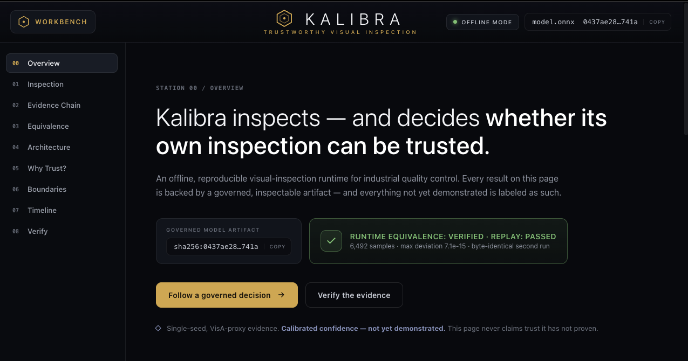
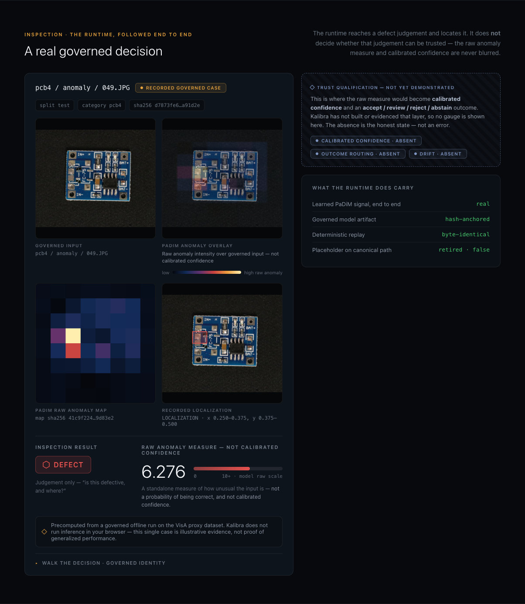
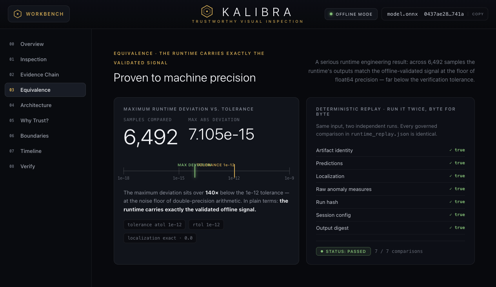
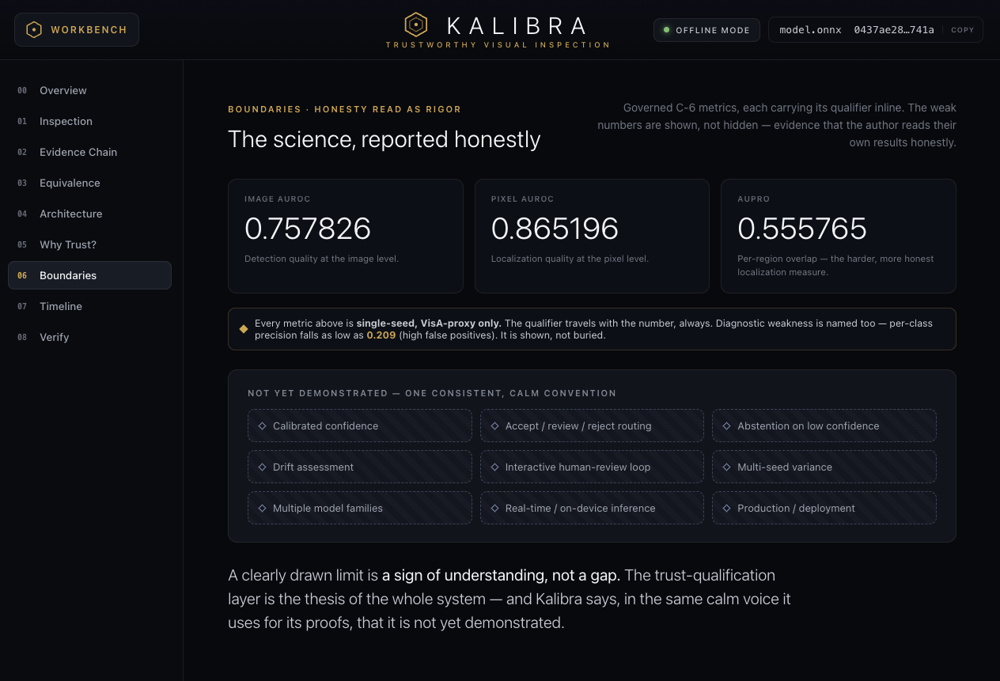
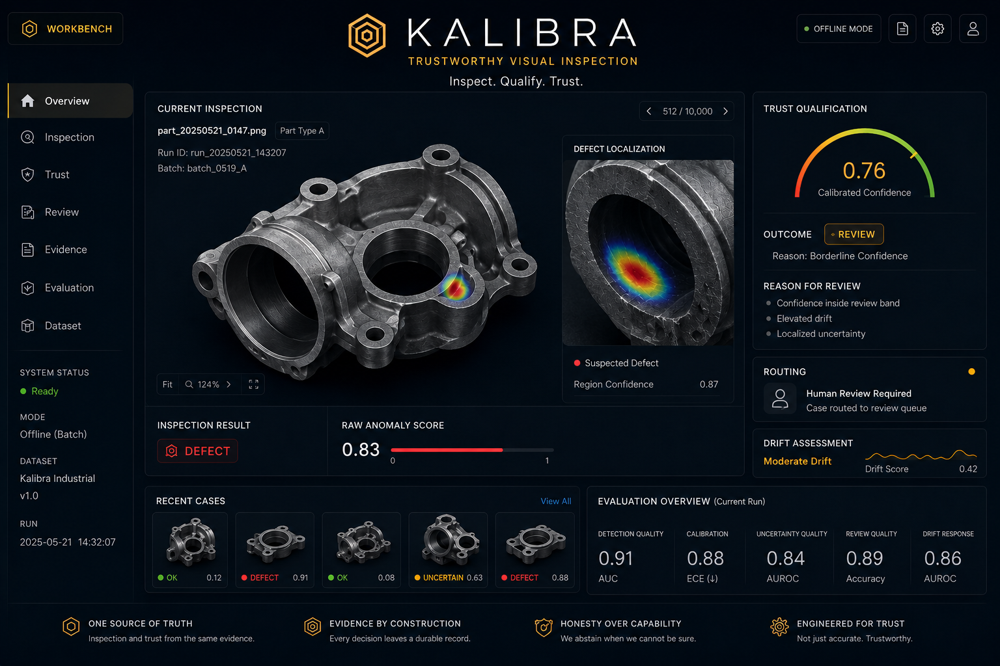

# Kalibra

A governed, reproducible visual-inspection runtime for industrial anomaly detection.

Kalibra is an offline visual-inspection project that carries a PaDiM anomaly signal from a governed VisA proxy dataset into ONNX Runtime, then verifies the integrated runtime with deterministic checks and hash-anchored evidence. The current evidence is single-seed and proxy-domain bounded; it does not demonstrate calibrated confidence, production readiness, or domain-of-record industrial performance.

Designed and built by [André Ramos](https://github.com/andrejr03) as an AI/ML engineering portfolio project.

## What This Project Demonstrates

- Runtime equivalence verified across 6,492 samples: maximum absolute deviation `7.105e-15` against a `1e-12` tolerance ([evidence](docs/evidence/RUNTIME_EQUIVALENCE.md)).
- Deterministic replay passed all 7 governed comparisons for the documented runtime evidence chain ([provider integration](docs/evidence/RUNTIME_PROVIDER_INTEGRATION.md)).
- The dataset-to-runtime path is governed through VisA provenance, PaDiM artifacts, ONNX export, runtime replay, and hash records.
- Runtime equivalence proves signal preservation through the integrated runtime; it does not prove accuracy, calibration, production readiness, or cross-domain validity.

## Technology Stack

| Area | Evidenced technologies |
|---|---|
| Runtime and evaluation | Python, NumPy, Pillow, PaDiM, ONNX, ONNX Runtime, pytest |
| Static portfolio | HTML, CSS, vanilla JavaScript |

VisA is used as the governed proxy dataset, not as the industrial domain of record.

## Quick Verification

Kalibra has three explicit verification levels. Level 1 is the public clean-clone
contract; Levels 2 and 3 require separately acquired governed VisA data.

### Level 1 — Clean-Clone Verification

Quick Verification works using tracked repository contents only:

```bash
git clone https://github.com/andrejr03/kalibra.git
cd kalibra
python3 -m pytest -q
python3 scripts/verify_public_clone.py
python3 scripts/build_portfolio_evidence_bundle.py --check
```

This checks the default committed-fixture tests, model and governed-artifact
SHA-256 records, the public evidence manifest, and portfolio bundle drift. It does
not perform governed runtime replay or scientific reproduction.

### Level 2 — Governed Runtime Verification

The full runtime-equivalence replay requires the separately governed VisA archive
and extracted dataset:

```bash
python3 scripts/verify_padim_runtime_equivalence.py verify
python3 scripts/verify_placeholder_retirement.py verify
python3 -m pytest -q -m governed_data
```

The dataset is not shipped in Git. That is an intentional licensing and governance
boundary, not a missing repository file. Acquisition, expected paths, and integrity
steps are documented in [VisA Acquisition and Governance](docs/engineering/VISA_ACQUISITION_AND_GOVERNANCE.md).

### Level 3 — Full Scientific Reproduction

Full scientific reproduction is a separate workflow requiring governed dataset
acquisition plus the documented training, inference, evaluation, export, and
runtime environment. It is not a default clean-clone guarantee. Follow the
[scientific evaluation methodology](docs/evidence/SCIENTIFIC_EVALUATION.md) after
completing the governed acquisition instructions.

Complete governed replay evidence is documented in [Runtime Equivalence](docs/evidence/RUNTIME_EQUIVALENCE.md) and [Runtime Provider Integration](docs/evidence/RUNTIME_PROVIDER_INTEGRATION.md).

## Current Status

Implemented and evidenced:

- Governed VisA proxy dataset, PaDiM baseline, and single-seed scientific evaluation.
- Governed ONNX export and runtime, including export equivalence, runtime equivalence, and deterministic replay.
- Canonical placeholder retirement and a static portfolio generated from governed artifacts.

Designed, not yet demonstrated:

- Calibrated confidence, accept / review / reject routing, abstention, drift assessment, and interactive human review.
- End-to-end validation, domain-of-record industrial performance, and multi-seed statistical characterisation.

Kalibra is an offline, batch-oriented, single-seed, VisA-proxy, non-production engineering artifact.

## Portfolio Experience

The portfolio is a static presentation that renders committed governed artifacts; it performs no browser inference and requires no network request.

- **Live portfolio:** https://andrejr03.github.io/kalibra/
- **Repository source:** [portfolio/](portfolio/)

Overview of the static evidence presentation and project boundary.



Governed runtime-inspection case showing the real VisA-proxy input, presentation-only PaDiM anomaly overlay, native raw anomaly map, recorded localization, and non-calibrated raw anomaly measure.



Runtime-equivalence station showing sample count, tolerance, maximum deviation, and replay status.



Scientific-boundaries station showing measured results, limitations, and absent trust capabilities.



## Engineering Domains

| Domain | Status | Evidence or next step |
|---|---|---|
| Inspection | Implemented and evidenced | PaDiM baseline and governed ONNX Runtime inspection path. |
| Trust Qualification | Designed, not yet demonstrated | Future calibration, abstention, and accept / review / reject qualification. |
| Human Review | Designed, not yet demonstrated | Future review routing and operator-facing evidence workflow. |
| Evidence | Implemented and evidenced | Hash records, governed replay files, and committed portfolio evidence bundle. |
| Evaluation | Implemented for the current slice | Single-seed VisA-proxy metrics, export equivalence, runtime equivalence, and replay checks. |

## Repository Structure

| Path | Purpose |
|---|---|
| `src/` | Runtime, inspection, evaluation, evidence, and domain modules. |
| `scripts/` | Governed training, export, verification, and evidence-bundle commands. |
| `tests/` | Unit, integration, runtime, provider, and artifact verification tests. |
| `artifacts/` | Tracked PaDiM, ONNX, runtime, equivalence, and replay artifacts. |
| `data/` | Governed VisA manifests, provenance, and derived evidence records. |
| `docs/` | Architecture, methodology, engineering notes, and evidence documents. |
| `portfolio/` | Deployable static portfolio generated from governed artifacts. |
| `assets/` | Portfolio screenshots, visual assets, and future workbench concept image. |

## Roadmap

All roadmap items are future work:

- Trust calibration and qualification.
- Accept / review / reject, abstention, and human-review routing.
- Drift assessment, multi-seed characterisation, and end-to-end validation.

## Future Concept: Workbench Prototype (Not Implemented)

This design concept explores the intended review surface; the calibrated confidence, routing, drift, and human-review capabilities shown here are not implemented or evidenced in the current runtime.

<details>
<summary>View the future workbench concept</summary>



Concept only: the interface visualizes intended trust qualification and review workflows that are not implemented in the current runtime.

</details>

## License

This project is licensed under the MIT License. See the [LICENSE](LICENSE) file for details.
