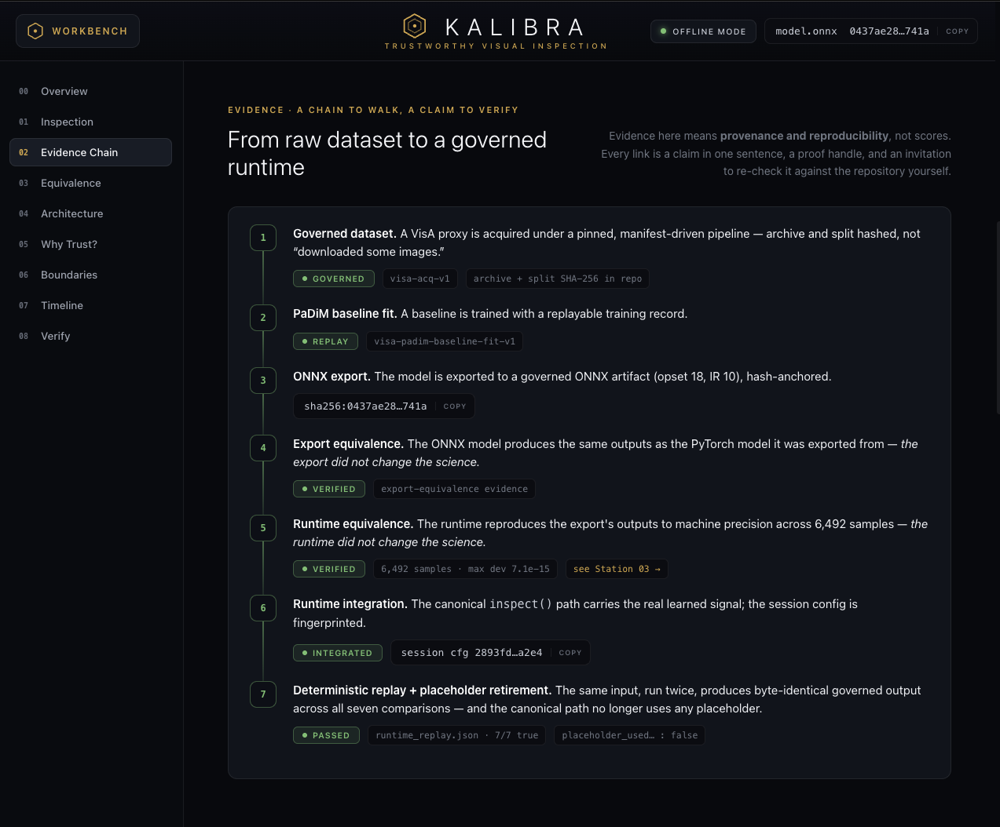
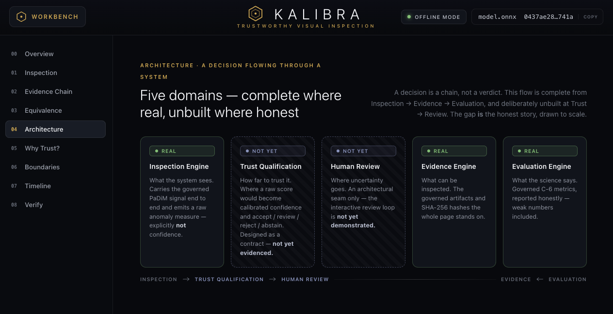
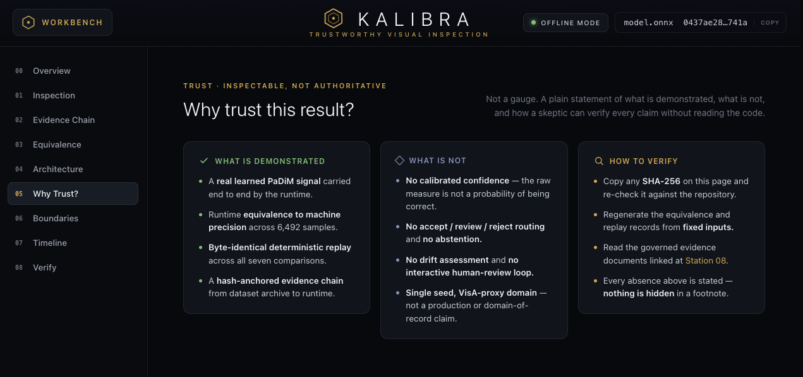
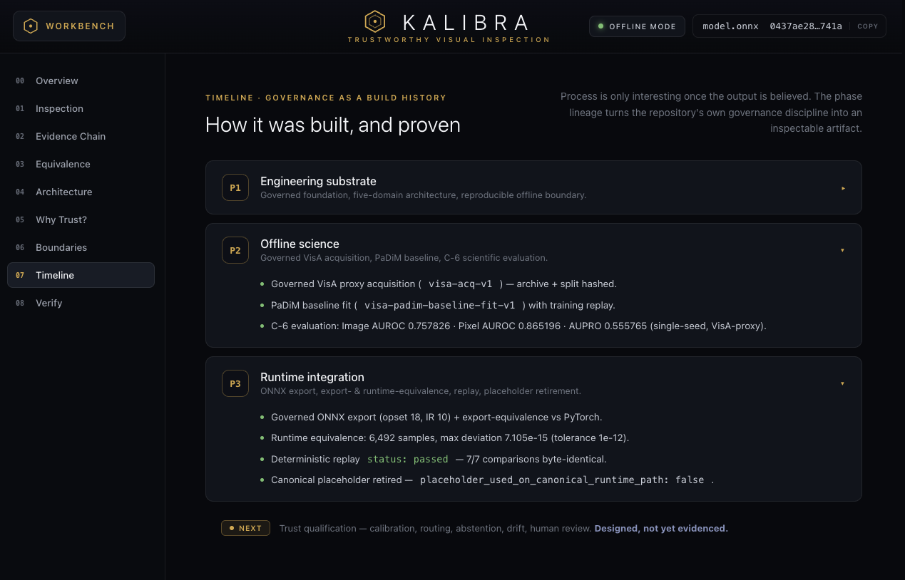
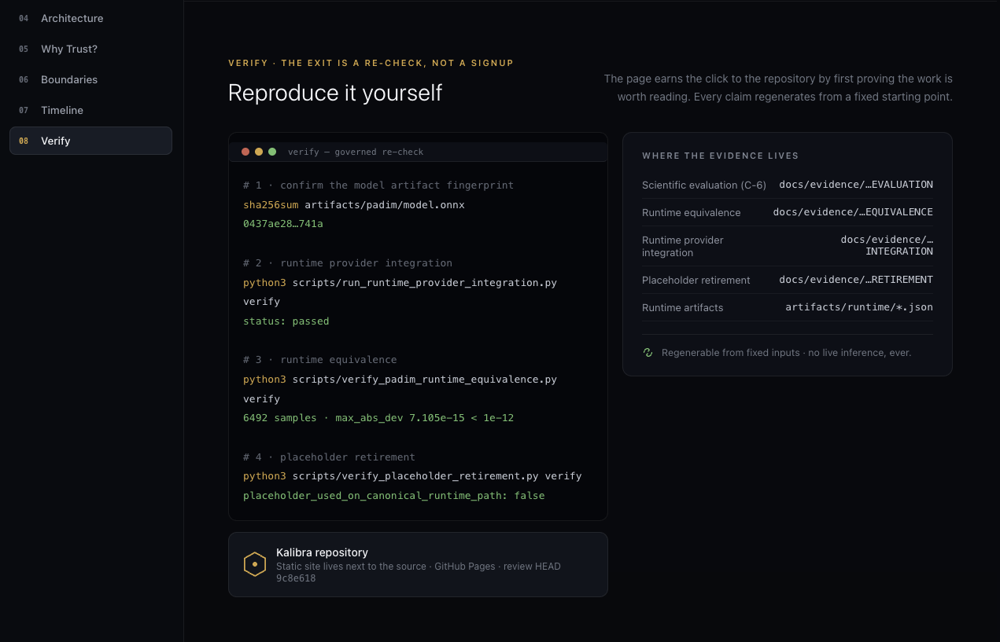

# Kalibra

Self-Evaluating Visual Inspection with Calibrated Uncertainty

Kalibra is an AI engineering project for trustworthy visual inspection in
industrial quality control. It is designed to inspect visual inputs for defects
and, for every inspection decision, determine how far that decision can be
trusted.

Kalibra is not a production system or a completed computer vision model. It is an
offline, batch, locally reproducible engineering artifact whose claims must be
supported by durable, inspectable evidence.

---

## Project Vision

Kalibra exists to answer two questions together: is this part defective, and can
the system be trusted when it says so?

---

## Engineering Philosophy

Kalibra is built around evidence before assertion. Raw inspection scores are not
treated as confidence until calibrated, uncertainty must have a path to human
review, and every result should be reproducible from a fixed starting point.

The project focuses on trustworthy AI through explicit boundaries, calibrated
trust, human-in-the-loop decision routing, and evidence that can be inspected
rather than merely claimed.

---

## Current Status

Kalibra has completed its documented engineering foundation and now has a
governed offline inspection runtime. The current implemented slice includes a
governed VisA proxy dataset, a PaDiM baseline, C-6 scientific evaluation, a
governed ONNX runtime, export and runtime equivalence, deterministic replay, and
retirement of the placeholder from the canonical runtime path.

The trust-qualification layer is designed but not yet evidenced. Kalibra does
not yet produce calibrated confidence, accept / review / reject routing,
abstention, drift assessment, or an interactive human-review loop.

- [x] Engineering foundation documented
- [x] Offline, batch, reproducible system boundary defined
- [x] Five-domain architecture established
- [x] Governed dataset, PaDiM baseline, and C-6 scientific evaluation
- [x] Governed ONNX runtime with export and runtime equivalence, deterministic replay
- [ ] Calibrated trust qualification
- [ ] Interactive human review and drift
- [ ] End-to-end validation

---

## Project Maturity

The offline inspection runtime is implemented and governed for the present
single-seed VisA-proxy evidence base. The system is not production-ready and
does not make a calibrated-confidence or domain-of-record performance claim.

---

## Portfolio Experience

Overview station for the static portfolio experience.

Runtime inspection station showing the governed local-provider projection.

Evidence chain station showing provenance from dataset to deterministic replay.

Runtime equivalence station showing sample count, deviation, and replay status.

Architecture station showing implemented and not-yet-demonstrated domains.

Trust explanation station separating demonstrated evidence from absent trust features.

Scientific boundaries station showing metrics and explicit limitations.

Engineering timeline station showing the governed build history.

Repository verification station showing reproducibility commands and evidence paths.

The static portfolio experience is implemented in `portfolio/` and is generated
from governed repository artifacts. It is configured for GitHub Pages at
`https://andrejr03.github.io/kalibra/` once Pages is enabled with GitHub Actions.

---

## Workbench Prototype

Official Kalibra Workbench prototype.

The workbench prototype shows the intended inspection surface for reviewing an
input, its suspected defect localization, trust qualification, human-review
routing, drift context, and evaluation summary from the same evidence trail.

---

## Engineering Domains

**Inspection** examines stable visual inputs and produces defect judgements,
localizations, and raw anomalousness measures.

**Trust Qualification** converts raw judgements into calibrated, qualified trust
statements, abstentions, and drift-aware caution.

**Human Review** routes uncertain and drifted cases to human judgement with the
evidence required for review.

**Evidence** preserves and presents durable records of decisions, confidence,
outcomes, routing, abstention, limitations, and supporting artifacts.

**Evaluation** measures the present system against its documented claims using
recorded, reproducible evidence.

---

## Repository Structure

- `docs/` - public foundation, architecture, requirements, methodology, roadmap,
  and engineering plan.
- `assets/` - project visuals and the official workbench prototype.
- `portfolio/` - deployable static Portfolio Experience for GitHub Pages.
- `README.md` - concise public overview of the current project state.

---

## Roadmap

Kalibra's roadmap is to move from documented foundation to a focused inspection
implementation, then add calibrated trust qualification, human review routing,
evidence recording, evaluation, and final end-to-end validation.

The project remains deliberately scoped: one focused inspection system before any
broader expansion.

---

## License

This project is licensed under the MIT License. See the [LICENSE](LICENSE) file
for details.
